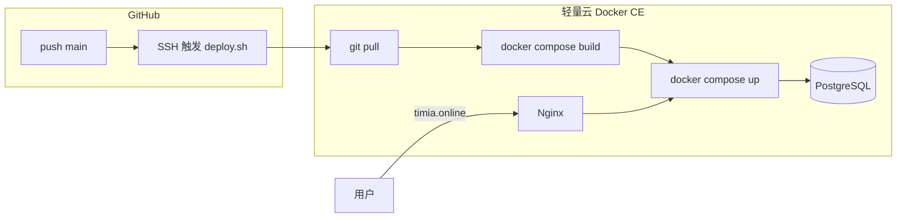

# Timia 生产部署指南（轻量云 · 无 TCR）

生产域名：**https://timia.online**

生产环境仅使用 **腾讯云轻量应用服务器（Docker CE 镜像）**：在服务器上 `git pull`，用 **Docker Compose 本地构建** 并启动，**不使用** 容器镜像服务（TCR/CCR）。

GitHub Actions 只通过 **SSH** 触发服务器上的 `deploy/deploy.sh`，不在云端构建或推送镜像。

## 架构



| 组件 | 说明 |
|------|------|
| `api` / `web` | 在轻量云上 `docker compose build`（见 `apps/*/Dockerfile`） |
| `db` | 官方 `postgres:16` 镜像，数据卷持久化 |
| `nginx` | 反代 + HTTPS（证书在宿主机 `/etc/letsencrypt`） |

| 文件 | 用途 |
|------|------|
| `.github/workflows/deploy.yml` | push `main` 后 SSH 执行部署 |
| `docker-compose.prod.yml` | 生产编排 |
| `deploy/bootstrap.sh` | **首次**初始化：clone 仓库 + 生成 `.env.prod` |
| `deploy/deploy.sh` | `git pull` → `build` → `up -d` |
| `deploy/nginx.conf` | `timia.online` HTTPS |
| `.env.prod.example` | 服务器 `.env.prod` 模板 |

---

## 一、一次性准备

### 1. 轻量应用服务器

- **应用镜像**：**Docker CE**（已预装 Docker）
- **规格**：建议 **2GB 内存及以上**（构建 Next.js 较吃内存）
- 记录 **公网 IP** → 后续 `SSH_HOST`、DNS

**防火墙**（轻量云控制台 → 实例 → **防火墙**）放通：

| 协议 | 端口 |
|------|------|
| TCP | 22 |
| TCP | 80 |
| TCP | 443 |

**SSH**：控制台查看登录用户（多为 `root`），配置 **SSH 密钥**（GitHub Actions 需密钥登录，不建议仅密码）。

登录后确认：

```bash
docker --version
docker compose version
```

### 2. DNS

`timia.online` **A 记录** → 轻量云公网 IP。

### 3. 首次初始化（`bootstrap.sh`）

SSH 登录轻量云后，任选一种方式拿到脚本并执行。

**方式 A — 从本机上传（私有仓库推荐）**

在本机项目根目录：

```bash
scp deploy/bootstrap.sh root@<轻量云IP>:/tmp/bootstrap.sh
ssh root@<轻量云IP> 'chmod +x /tmp/bootstrap.sh && /tmp/bootstrap.sh git@github.com:<你的用户名>/timia.git /opt/timia'
```

**方式 B — 公开仓库直接下载脚本**

```bash
curl -fsSL https://raw.githubusercontent.com/<你的用户名>/timia/main/deploy/bootstrap.sh -o /tmp/bootstrap.sh
chmod +x /tmp/bootstrap.sh
/tmp/bootstrap.sh https://github.com/<你的用户名>/timia.git /opt/timia
```

**私有仓库**：先在服务器生成 Deploy Key 并加到 GitHub **Settings → Deploy keys**：

```bash
ssh-keygen -t ed25519 -C "timia-lighthouse" -f ~/.ssh/id_ed25519 -N ""
cat ~/.ssh/id_ed25519.pub
```

`bootstrap.sh` 会：

1. 将仓库 clone 到 `/opt/timia`（默认分支 `main`）
2. 若不存在则复制 `.env.prod.example` → `.env.prod`
3. 打印后续步骤（改密钥、证书、首次 deploy）

已初始化过再次执行时，只会 `git pull` 更新代码，**不会覆盖**已有 `.env.prod`。

**方式 C — 手动 clone**（不用脚本时）

```bash
sudo mkdir -p /opt/timia && sudo chown "$USER:$USER" /opt/timia
git clone https://github.com/<你的用户名>/timia.git /opt/timia
cp /opt/timia/.env.prod.example /opt/timia/.env.prod
```

### 4. 配置 `.env.prod`

```bash
nano /opt/timia/.env.prod
```

必填项：

| 变量 | 说明 |
|------|------|
| `POSTGRES_PASSWORD` | `openssl rand -hex 24` |
| `JWT_SECRET` | `openssl rand -hex 32` |
| `DATABASE_URL` | 密码与上一致，主机必须是 `db` |
| `CORS_ORIGINS` | `https://timia.online` |
| `NEXT_PUBLIC_API_BASE_URL` | `https://timia.online/api` |

示例 `DATABASE_URL`：

```text
postgresql+psycopg://timia:<POSTGRES_PASSWORD>@db:5432/timia
```

### 5. HTTPS 证书（首次）

Nginx 需要 `/etc/letsencrypt/live/timia.online/`。首次申请前先停 nginx：

```bash
cd /opt/timia
docker compose -f docker-compose.prod.yml stop nginx 2>/dev/null || true

sudo apt-get update && sudo apt-get install -y certbot
sudo certbot certonly --standalone -d timia.online
```

续期（示例）：

```bash
echo "0 3 * * * root certbot renew --quiet && docker compose -f /opt/timia/docker-compose.prod.yml exec nginx nginx -s reload" | sudo tee /etc/cron.d/timia-certbot
```

### 6. 首次手动启动（验证环境）

```bash
cd /opt/timia
chmod +x deploy/deploy.sh
export SKIP_GIT_PULL=1   # 代码已在本地，跳过 pull
./deploy/deploy.sh
```

检查：

```bash
curl -fsS https://timia.online/api/health
```

### 7. GitHub Actions Secrets

仓库 **Settings → Secrets and variables → Actions**：

| Secret | 说明 |
|--------|------|
| `SSH_HOST` | 轻量云公网 IP |
| `SSH_USER` | 如 `root` |
| `SSH_PRIVATE_KEY` | 对应实例的私钥全文（PEM） |
| `SSH_PORT` | 可选；不填则默认 22 |
| `DEPLOY_PATH` | 仓库路径，如 `/opt/timia` |

**不需要** `TCR_*` 等镜像仓库凭据。

---

## 二、日常部署（自动）

推送到 **`main`**，或手动运行 **Actions → Deploy to Lighthouse**。

服务器上执行流程（`deploy/deploy.sh`）：

1. `git pull origin main`
2. `docker compose -f docker-compose.prod.yml --env-file .env.prod build`
3. `docker compose ... up -d`

### 验证

```bash
curl -fsS https://timia.online/api/health
```

---

## 三、手动部署 / 回滚

SSH 登录轻量云：

```bash
cd /opt/timia
./deploy/deploy.sh
```

回滚到指定 commit：

```bash
cd /opt/timia
git fetch origin
git checkout <commit-sha>
export SKIP_GIT_PULL=1
./deploy/deploy.sh
```

确认无误后，如需让 `main` 与此一致，再在 GitHub 上 revert 或合并修复提交。

---

## 四、运维

```bash
cd /opt/timia

docker compose -f docker-compose.prod.yml ps
docker compose -f docker-compose.prod.yml logs -f --tail=200 api
docker compose -f docker-compose.prod.yml logs -f --tail=200 web
docker compose -f docker-compose.prod.yml logs -f --tail=200 nginx
docker compose -f docker-compose.prod.yml logs -f --tail=200 db
```

仅重建某一服务：

```bash
docker compose -f docker-compose.prod.yml --env-file .env.prod build web
docker compose -f docker-compose.prod.yml --env-file .env.prod up -d web
```

数据库备份：

```bash
docker compose -f docker-compose.prod.yml exec -T db \
  pg_dump -U timia timia > "backup_$(date +%F).sql"
```

---

## 五、排障

| 现象 | 处理 |
|------|------|
| Actions SSH 失败 | 检查 `SSH_*`、`DEPLOY_PATH`、防火墙 22、密钥是否匹配实例 |
| `No .git` | 未 clone 仓库，按「一、3」操作 |
| `git pull` 失败（私有库） | 配置 Deploy Key 或检查 `git remote` |
| `build` 很慢或 OOM | 升级内存；或单独 `build api` / `build web` |
| CORS 错误 | `.env.prod` 中 `CORS_ORIGINS=https://timia.online` |
| 前端 API 地址错误 | 修改 `NEXT_PUBLIC_API_BASE_URL` 后必须 **`build web`** 再 `up` |
| 迁移失败 | `docker compose logs api`（启动时自动 `alembic upgrade head`） |
| HTTPS 失败 | 证书路径是否为 `/etc/letsencrypt/live/timia.online/` |
| 外网无法访问 | 轻量云 **防火墙** 放通 80/443 |

---

## 六、与「TCR + 拉镜像」方案的区别

| 项目 | 本方案（仅轻量云） | TCR 方案 |
|------|-------------------|----------|
| 构建位置 | 轻量云本机 | GitHub Actions |
| 镜像仓库 | 不需要 | 需要 TCR |
| 部署速度 | 首次/全量 build 较慢 | pull 较快 |
| 适用 | 单机、简单、无额外服务 | 多机、大镜像、构建与运行分离 |

---

## 安全说明

- `.env.prod` 仅保存在服务器，勿提交 Git（已加入 `.gitignore`）。
- 若曾泄露数据库或 JWT 密钥，请立即轮换并重启 `api`/`db`（改密码需同步 `DATABASE_URL`）。
