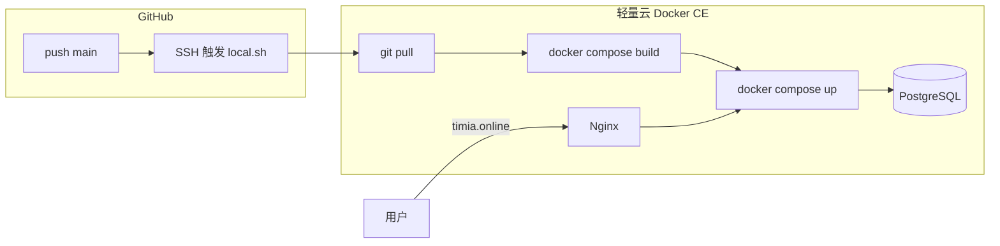

# Timia 生产部署指南（轻量云 · 无 TCR）

生产域名：**https://timia.online**

生产环境仅使用 **腾讯云轻量应用服务器（Docker CE 镜像）**：在服务器上 `git pull`，用 **Docker Compose 本地构建** 并启动，**不使用** 容器镜像服务（TCR/CCR）。

自动部署两种方式（二选一或同时用）：

1. **轮询部署（推荐，轻量云）**：服务器每 3 分钟 `git fetch`，`main` 有新提交则执行 `local.sh`——**不需要** GitHub 连 SSH 进来。
2. **GitHub Actions SSH**：push 后由 Actions SSH 执行 `local.sh`；从 GitHub 连国内轻量云常被 **`connection reset by peer`** 拒绝，仅作辅助。

## 架构



| 组件 | 说明 |
|------|------|
| `core-service` / `web` | 在轻量云上 `docker compose build`（见 `codes/*/Dockerfile`） |
| `db` | 官方 `postgres:16` 镜像，数据卷持久化 |
| `nginx` | 反代 + HTTPS（证书在宿主机 `/etc/letsencrypt`） |

| 文件 | 用途 |
|------|------|
| `.github/workflows/deploy.yml` | push `main` 后 SSH 执行部署 |
| `docker-compose.prod.yml` | 生产编排 |
| `deploy/local.sh` | 服务器部署；子命令 `bootstrap` / `poll` / `install-cron` |
| `deploy/dc.sh` | 带 `.env.prod` 的 compose 命令 |
| `deploy/remote.sh` | 本机构建镜像并上传到服务器（`pack` / `upload` / 默认全部） |
| `deploy/nginx.conf` | `timia.online` HTTPS（compose 挂载此路径） |
| `.env.prod.example` | 服务器 `.env.prod` 模板 |

---

## 一、一次性准备

### 1. 轻量应用服务器

- **应用镜像**：**Docker CE**（已预装 Docker）
- **规格**：建议 **2GB 内存及以上**（构建 Next.js 较吃内存）
- 记录 **公网 IP** → 后续 `SSH_HOST`、DNS

**防火墙**（轻量云控制台 → 实例 → **防火墙**）放通：

| 协议 | 端口 |
|------|------|
| TCP | 22 |
| TCP | 80 |
| TCP | 443 |

**SSH**：控制台查看登录用户（多为 `root`），配置 **SSH 密钥**（GitHub Actions 需密钥登录，不建议仅密码）。

登录后确认：

```bash
docker --version
docker compose version
```

**国内轻量云建议立刻配置镜像加速**（避免 build 时 `0B / xxMB` 卡住）：见下文「拉取基础镜像不动」一节，手动配置 `/etc/docker/daemon.json`。

### 2. DNS

`timia.online` **A 记录** → 轻量云公网 IP。

### 3. 首次初始化（`local.sh bootstrap`）

SSH 登录轻量云后，任选一种方式执行。

**方式 A — 从本机上传（私有仓库推荐）**

在本机项目根目录：

```bash
scp deploy/local.sh root@<轻量云IP>:/tmp/local.sh
ssh root@<轻量云IP> 'chmod +x /tmp/local.sh && /tmp/local.sh bootstrap git@github.com:<你的用户名>/timia.git /opt/timia'
```

**方式 B — 公开仓库 clone 后执行**

```bash
git clone https://github.com/<你的用户名>/timia.git /opt/timia
cd /opt/timia
bash deploy/local.sh bootstrap git@github.com:<你的用户名>/timia.git /opt/timia
```

**私有仓库**：先在服务器生成 Deploy Key 并加到 GitHub **Settings → Deploy keys**：

```bash
ssh-keygen -t ed25519 -C "timia-lighthouse" -f ~/.ssh/id_ed25519 -N ""
cat ~/.ssh/id_ed25519.pub
```

`local.sh bootstrap` 会：

1. 将仓库 clone 到 `/opt/timia`（默认分支 `main`）
2. 若不存在则复制 `.env.prod.example` → `.env.prod`
3. 打印后续步骤（改密钥、证书、首次 deploy）

已初始化过再次执行时，只会 `git pull` 更新代码；密钥在 **`/etc/timia/.env.prod`**，不会被覆盖。

**方式 C — 手动 clone**（不用脚本时）

```bash
sudo mkdir -p /opt/timia && sudo chown "$USER:$USER" /opt/timia
git clone https://github.com/<你的用户名>/timia.git /opt/timia
cp /opt/timia/.env.prod.example /opt/timia/.env.prod
```

### 4. 配置生产环境变量（`/etc/timia/.env.prod`）

| 环境 | 配置文件 | 位置 |
|------|----------|------|
| 本地开发 | `codes/core-service/.env`、`codes/web/.env.local` | 见 `.env.example` |
| **生产轻量云** | **`.env.prod`** | **`/etc/timia/.env.prod`**（在 git 仓库外） |

**不要把密钥放在 `/opt/timia/.env.prod`**。若该文件曾被 git 跟踪，`git pull` 可能覆盖、删除或还原成模板。应使用仓库外的 `/etc/timia/.env.prod`。

```bash
sudo mkdir -p /etc/timia
sudo cp /opt/timia/.env.prod.example /etc/timia/.env.prod
sudo nano /etc/timia/.env.prod
sudo chmod 600 /etc/timia/.env.prod
```

若你已有 `/opt/timia/.env.prod`，迁出仓库并修复 git：

```bash
cd /opt/timia
git pull
sudo mv .env.prod /etc/timia/.env.prod
sudo chmod 600 /etc/timia/.env.prod
```

生产 **不需要** 在 `codes/core-service/`、`codes/web/` 下创建 `.env`。

必填项：

| 变量 | 说明 |
|------|------|
| `POSTGRES_PASSWORD` | `openssl rand -hex 24` |
| `JWT_SECRET` | `openssl rand -hex 32` |
| `DATABASE_URL` | 密码与上一致，主机必须是 `db` |
| `CORS_ORIGINS` | `https://timia.online` |
| `NEXT_PUBLIC_API_BASE_URL` | `https://timia.online/core-service` |

示例 `DATABASE_URL`：

```text
postgresql+psycopg://timia:<POSTGRES_PASSWORD>@db:5432/timia
```

### 5. HTTPS 证书（首次）

Nginx 需要 `/etc/letsencrypt/live/timia.online/`。首次申请前先停 nginx：

```bash
cd /opt/timia
./deploy/dc.sh stop nginx 2>/dev/null || true

sudo apt-get update && sudo apt-get install -y certbot
sudo certbot certonly --standalone -d timia.online
```

续期（示例）：

```bash
echo "0 3 * * * root certbot renew --quiet && docker compose -f /opt/timia/docker-compose.prod.yml exec nginx nginx -s reload" | sudo tee /etc/cron.d/timia-certbot
```

### 6. 首次手动启动（验证环境）

```bash
cd /opt/timia
chmod +x deploy/local.sh
export SKIP_GIT_PULL=1   # 代码已在本地，跳过 pull
./deploy/local.sh
```

检查：

```bash
curl -fsS https://timia.online/core-service/health
```

### 7. 自动部署（推荐：轮询，无需 GitHub SSH）

在轻量云执行一次（push 后约 **3 分钟内**自动 `git pull` + 构建）：

```bash
cd /opt/timia
git pull
sudo bash deploy/local.sh install-cron
```

查看是否在部署：

```bash
tail -f /var/log/timia-deploy-poll.log
```

手动触发检查（不等待 cron）：

```bash
cd /opt/timia
bash deploy/local.sh poll
```

**原理**：`local.sh poll` 比较 `HEAD` 与 `origin/main`，有更新才跑部署；用文件锁避免重复构建。

启用轮询后，即使 Actions SSH 失败，**推送到 `main` 仍会自动上线**。

### 8. GitHub Actions Secrets（可选 SSH 部署）

仓库 **Settings → Secrets and variables → Actions**：

| Secret | 说明 |
|--------|------|
| `SSH_HOST` | 轻量云公网 IP |
| `SSH_USER` | 如 `root` |
| `SSH_PRIVATE_KEY` | 对应实例的私钥全文（PEM） |
| `SSH_PORT` | 可选；不填则默认 22 |
| `DEPLOY_PATH` | 仓库路径，如 `/opt/timia` |

**不需要** `TCR_*` 等镜像仓库凭据。

---

## 二、日常部署（自动）

### 部署模式（缩短耗时）

默认 **`smart`**：只拉代码，**仅当 `codes/core-service` 或 `codes/web` 有改动时才 build**，改文档不会触发 30 分钟 web 构建。

| 命令 | 耗时 | 适用 |
|------|------|------|
| `bash deploy/local.sh` | 智能最短 | 日常 push 后（默认 smart） |
| `DEPLOY_MODE=quick bash deploy/local.sh` | 最快（秒级～1 分钟） | 只改了配置/重启，或镜像已是最新 |
| `DEPLOY_MODE=full bash deploy/local.sh` | 最慢（全量 build） | 依赖升级、构建异常、首次部署 |
| `DEPLOY_MODE=core-service bash deploy/local.sh` | 中等 | 只改了后端 |
| `DEPLOY_MODE=web bash deploy/local.sh` | 慢 | 只改了前端 |

`git fetch + reset` 已替代 `git pull`，一般更快。

推送到 **`main`** 后：

- **已安装轮询**（推荐）：服务器约 3 分钟内自动部署，看 `tail -f /var/log/timia-deploy-poll.log`
- **仅 Actions SSH**：在 **Actions → Deploy to Lighthouse** 查看是否成功（可能因 SSH 被重置而失败）

服务器上执行流程（`deploy/local.sh`）：

1. `git pull origin main`
2. `docker compose -f docker-compose.prod.yml --env-file .env.prod build`
3. `docker compose ... up -d`

### 验证

```bash
curl -fsS https://timia.online/core-service/health
```

---

## 三、手动部署 / 回滚

### 防止 SSH 断开导致部署中断

`local.sh` 会在服务器上执行 `docker compose build`（尤其是 **web/Next.js**），可能耗时 **10～30+ 分钟**。SSH 断开时，前台进程通常会收到 SIGHUP 并被终止。

**推荐：用 `tmux` 或 `screen` 在后台跑**

```bash
ssh root@<轻量云IP>
cd /opt/timia

# 方式 1：tmux（推荐）
tmux new -s timia-deploy
./deploy/local.sh
# 断开会话：Ctrl+b 然后按 d
# 重新连上后恢复：tmux attach -t timia-deploy
```

```bash
# 方式 2：nohup + 日志文件
cd /opt/timia
nohup ./deploy/local.sh > /tmp/timia-deploy.log 2>&1 &
tail -f /tmp/timia-deploy.log
```

未安装 tmux 时：`apt-get install -y tmux`

### 执行部署

SSH 登录轻量云：

```bash
cd /opt/timia
./deploy/local.sh
```

### SSH 断开后如何查看进度

重新 SSH 登录后，在 `/opt/timia` 依次检查：

**1. 部署脚本是否还在跑**

```bash
pgrep -af "local.sh|docker compose"
```

有输出说明仍在 build/up；没有输出说明已结束（成功或失败）。

**2. 若用了 nohup，看日志**

```bash
tail -f /tmp/timia-deploy.log
```

**3. Docker 是否仍在构建**

```bash
docker ps                    # 运行中的容器
docker ps -a --last 5      # 最近退出的容器（含 build 中间层）
docker images | head -20   # 是否已有新构建的 core-service/web 镜像
```

**4. Compose 服务状态**

```bash
cd /opt/timia
./deploy/dc.sh ps
```

> 不要省略 `--env-file`：请用 `./deploy/dc.sh`，不要直接 `docker compose -f docker-compose.prod.yml ps`，否则会出现 `POSTGRES_USER variable is not set` 警告且服务起不来。

| 状态 | 含义 |
|------|------|
| 四个服务均为 `Up` | 部署很可能已成功 |
| 无 `core-service`/`web` 或状态 `Exit` | build 未完成或 `up` 失败 |
| 仅有 `db` 在跑 | 可能卡在 build 或脚本已退出 |

**5. 查看服务日志（定位失败）**

```bash
./deploy/dc.sh logs --tail=100 core-service
./deploy/dc.sh logs --tail=100 web
```

**6. 验证是否已上线**

```bash
curl -fsS https://timia.online/core-service/health
```

**7. 若脚本已死、状态不明 — 安全重跑**

```bash
cd /opt/timia
tmux new -s timia-deploy
export SKIP_GIT_PULL=1    # 若代码已是最新可跳过 pull
./deploy/local.sh
```

> GitHub Actions 触发的部署同样在服务器上执行 `local.sh`；可在仓库 **Actions** 页查看该次 workflow 是否成功，不必保持本地 SSH 不断开。

回滚到指定 commit：

```bash
cd /opt/timia
git fetch origin
git checkout <commit-sha>
export SKIP_GIT_PULL=1
./deploy/local.sh
```

确认无误后，如需让 `main` 与此一致，再在 GitHub 上 revert 或合并修复提交。

---

## 四、运维

生产环境统一用包装脚本（自动加载 `.env.prod`）：

```bash
cd /opt/timia
./deploy/dc.sh ps
./deploy/dc.sh logs -f --tail=200 core-service
./deploy/dc.sh logs -f --tail=200 web
./deploy/dc.sh logs -f --tail=200 nginx
./deploy/dc.sh logs -f --tail=200 db
```

仅重建某一服务：

```bash
./deploy/dc.sh build web
./deploy/dc.sh up -d web
```

数据库备份：

```bash
./deploy/dc.sh exec -T db pg_dump -U timia timia > "backup_$(date +%F).sql"
```

---

## 五、排障

### `local.sh` 卡住、长时间无输出

脚本会按顺序执行：**git pull → build core-service → build web → up**。多数「假死」是 **web 的 `npm ci` / `next build`**（轻量云 2GB 内存可能要 **20～40 分钟**），BuildKit 默认几乎不刷屏。

**先确认卡在哪一步**（另开一个 SSH 窗口）：

```bash
pgrep -af "local.sh|docker|npm|node"
tail -20 /tmp/timia-deploy.log   # 若用 nohup 部署
```

| 最后一行日志 | 实际在做什么 |
|--------------|--------------|
| `Step 1/4: git` | 拉代码；私有库未配 Deploy Key 可能一直等（新版本会快速失败） |
| `Step 2/4: docker build core-service` | 构建 core-service 镜像 |
| `Step 3/4: docker build web` | 构建前端（最慢，属正常） |
| `Step 4/4: docker compose up` | 启动容器 |

**建议**：用 `tmux` 跑部署，并 `git pull` 拿到带分步日志的 `local.sh`：

```bash
cd /opt/timia && git pull
tmux new -s timia-deploy
export SKIP_GIT_PULL=1   # 代码已最新时可跳过
./deploy/local.sh
```

**单独重试某一阶段**：

```bash
cd /opt/timia
./deploy/dc.sh build --progress=plain core-service
./deploy/dc.sh build --progress=plain web   # 最耗时
./deploy/dc.sh up -d
```

**git 阶段卡住**：检查 Deploy Key，`ssh -T git@github.com` 应成功；或临时 `export SKIP_GIT_PULL=1` 跳过。

**内存不足**（build 极慢或进程被 kill）：

```bash
free -h
dmesg | tail -20 | grep -i oom
```

可添加 2GB swap 或升级套餐后再 build。

### 拉取基础镜像 `0B / 25MB` 不动（Docker Hub 很慢）

构建日志里出现类似：

```text
=> => sha256:dc53ac... 0B / 25.15MB
```

说明正在从 **Docker Hub** 下载基础镜像层（如 `node:20-alpine`、`python:3.12-slim`），国内轻量云访问 Docker Hub 经常极慢或像卡住。**不是** 你的业务代码问题。

**处理：配置镜像加速（一次性）**

在轻量云 SSH 执行（需 root），手动写入 `/etc/docker/daemon.json` 后 `sudo systemctl restart docker`：

```json
{
  "registry-mirrors": [
    "https://mirror.ccs.tencentyun.com",
    "https://docker.m.daocloud.io"
  ]
}
```

**验证能否拉镜像**（应有进度、能完成）：

```bash
docker pull node:20-alpine
docker pull python:3.12-slim
docker pull postgres:16
docker pull nginx:alpine
```

通过后再部署：

```bash
cd /opt/timia
tmux new -s timia-deploy
export SKIP_GIT_PULL=1
./deploy/local.sh
```

若仍卡在 `0B`：检查轻量云 **带宽/流量** 是否用尽，或换时段重试；必要时在控制台重启实例后再 `docker pull`。

| 现象 | 处理 |
|------|------|
| `sha256... 0B / xx MB` 无进度 | 配置 **Docker 镜像加速**，见上文；先 `docker pull node:20-alpine` 测试 |
| `local.sh` 无输出像卡死 | 多为 **web build** 或 **拉基础镜像**；用 `tmux`、`--progress=plain`、见上文 |
| Actions `connection reset by peer` | **启用轮询**：`sudo bash deploy/local.sh install-cron`（见「一、7」）；或检查防火墙 22 对 `0.0.0.0/0` 放通、Secrets 中 IP/密钥正确、本机 `ssh -i key user@IP` 能否登录 |
| Actions SSH 失败 | 检查 `SSH_*`、`DEPLOY_PATH`、防火墙 22、密钥；或改用轮询部署 |
| Actions `chmod: Operation not permitted` | `SSH_USER` 对 `/opt/timia` 无写权限时用 `bash deploy/local.sh`（已修复）；或把目录属主改为该用户 |
| `No .git` | 未 clone 仓库，按「一、3」操作 |
| `git pull` 失败（私有库） | 配置 Deploy Key 或检查 `git remote` |
| `build` 很慢或 OOM | 用 **`smart`** / `DEPLOY_MODE=quick`；只改 core-service 用 `DEPLOY_MODE=core-service`；升级内存 |
| 每次部署都要 build web | 确认用默认 `smart`；全量才用 `DEPLOY_MODE=full` |
| CORS 错误 | `.env.prod` 中 `CORS_ORIGINS=https://timia.online` |
| 前端 API 地址错误 | 修改 `NEXT_PUBLIC_API_BASE_URL` 后必须 **`build web`** 再 `up` |
| 迁移失败 | `docker compose logs core-service`（启动时自动 `alembic upgrade head`） |
| HTTPS 失败 | 证书路径是否为 `/etc/letsencrypt/live/timia.online/` |
| 外网无法访问 | 轻量云 **防火墙** 放通 80/443 |
| SSH 断开不知道进度 | 用 `tmux`/`nohup` 部署；重连后 `pgrep`、`compose ps`、见上文「SSH 断开后如何查看进度」 |
| `POSTGRES_* variable is not set` | 缺少 `/etc/timia/.env.prod`；用 `./deploy/dc.sh`，勿在 `codes/core-service` 下建 `.env` |
| `git pull` 覆盖 `.env.prod` | 密钥改放到 **`/etc/timia/.env.prod`**，运行 `bash deploy/local.sh bootstrap` 或手动 `git rm --cached .env.prod` |
| `ps` 无任何容器 | 尚未成功执行 `./deploy/local.sh`，或 build 失败；`./deploy/dc.sh logs core-service` 排查 |

---

## 六、与「TCR + 拉镜像」方案的区别

| 项目 | 本方案（仅轻量云） | TCR 方案 |
|------|-------------------|----------|
| 构建位置 | 轻量云本机 | GitHub Actions |
| 镜像仓库 | 不需要 | 需要 TCR |
| 部署速度 | 首次/全量 build 较慢 | pull 较快 |
| 适用 | 单机、简单、无额外服务 | 多机、大镜像、构建与运行分离 |

---

## 安全说明

- 生产密钥保存在 **`/etc/timia/.env.prod`**，勿放在 git 仓库目录内，勿提交 Git。
- 若曾泄露数据库或 JWT 密钥，请立即轮换并重启 `core-service`/`db`（改密码需同步 `DATABASE_URL`）。
