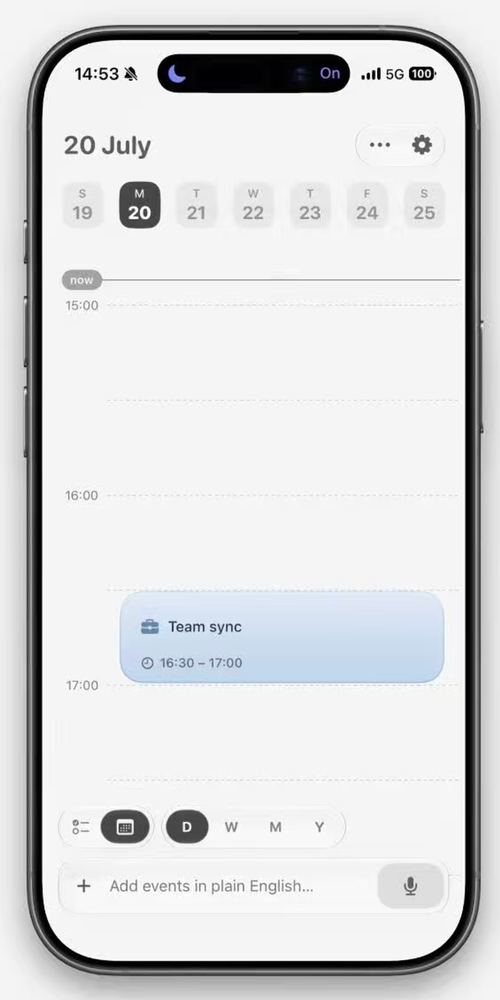

# 移动端日历日视图布局参考

> 分析日期：2026-07-30
> 参考图：`assets/calendar-day-layout-reference.png`
> 用途：供 Timia iOS 日程页面后续设计、布局调整和 SwiftUI 实现参考。
> 说明：尺寸来自截图目测与比例换算，并非源设计稿的精确标注。



## 1. 页面结构结论

页面采用“固定顶部导航 + 可滚动时间轴 + 固定底部操作区”的三段式结构。

```text
Root ZStack
├─ 页面背景
├─ Main VStack
│  ├─ 系统状态栏 / Safe Area
│  ├─ 页面标题与更多操作
│  ├─ 一周日期选择器
│  └─ 日程时间轴（主要可滚动区域）
└─ Bottom Overlay
   ├─ 视图与范围切换器
   └─ 快速创建输入框
```

核心视觉策略：

- 顶部负责“当前日期”和“选择日期”。
- 中部时间轴占据绝大多数屏幕空间，弱化网格、突出任务。
- 底部工具悬浮在内容上方，始终可访问。
- 页面以低对比度灰白为底，深灰作为选中态，浅蓝作为任务强调色。

## 2. 垂直分区

以下高度以实际 iPhone 逻辑尺寸为参考建议，不是截图原始像素。

| 区域 | 建议高度 | 布局特点 |
|---|---:|---|
| 顶部安全区与状态栏 | 系统控制 | 保留 Dynamic Island 和状态栏空间 |
| 标题操作栏 | 56–64 pt | 左侧大日期，右侧更多与设置 |
| 周日期选择器 | 64–72 pt | 7 个等权日期单元，横向排列 |
| 标题与时间轴间距 | 28–40 pt | 形成明显呼吸感 |
| 时间轴 | 自适应剩余空间 | 垂直滚动，小时刻度固定宽度 |
| 视图切换器 | 44–50 pt | 悬浮胶囊，位于输入框上方 |
| 快速创建输入框 | 56–64 pt | 底部主操作，避开 Home Indicator |
| 底部安全区 | 系统控制 | 不让输入框贴住屏幕底边 |

页面左右主边距约为 20–24 pt。时间轴左侧刻度栏约为 52–64 pt，任务内容区占据其余宽度。

## 3. 顶部区域

### 3.1 标题操作栏

左侧：

- 显示 `20 July`，采用较大字号和半粗字重。
- 文案表达当前选中日期，而不是完整年月导航。
- 与屏幕左边保持约 24 pt 间距。

右侧：

- 一个白色描边胶囊容器。
- 内含“更多”和“设置”两个图标按钮。
- 容器高度约 42–46 pt。
- 图标建议具备独立的 44 × 44 pt 点击区域。

### 3.2 一周日期选择器

- 一行展示 7 天。
- 每个日期单元分为两行：上方星期首字母，下方日期数字。
- 单元宽度约 48–56 pt，高度约 60–66 pt。
- 未选中日期使用极浅灰底或透明底。
- 选中日期使用深灰色圆角矩形，文字反白。
- 单元圆角约 12–16 pt。
- 单元之间保留约 8–12 pt 间距。

建议数据结构：

```text
WeekDateItem
├─ weekdayShortLabel
├─ dayNumber
├─ isSelected
├─ isToday
└─ date
```

选中态优先级建议：

1. 当前选中日期：深色实心背景。
2. 今天但未选中：强调色描边或文字强调。
3. 普通日期：浅灰文字与弱背景。

## 4. 时间轴区域

### 4.1 两列布局

时间轴由左侧刻度栏和右侧内容栏组成：

```text
Timeline HStack
├─ Time Axis（固定宽度）
│  ├─ now 标签
│  ├─ 15:00
│  ├─ 16:00
│  └─ 17:00
└─ Event Canvas（自适应宽度）
   ├─ 当前时间线
   ├─ 小时虚线
   ├─ 半小时虚线
   └─ 任务卡片
```

### 4.2 时间网格

- 每小时高度保持一致。
- 整点线和半小时线均为浅灰虚线，整点线可略深。
- 时间文字位于左侧刻度栏，不进入任务内容区。
- 网格线从任务内容区左边缘延伸至右边缘。
- 截图中一个小时的视觉高度较大，约为 130–150 pt，更适合查看短任务。

建议参数：

| 参数 | 建议值 |
|---|---:|
| 时间轴宽度 | 56 pt |
| 每小时高度 | 120–144 pt |
| 半小时分隔 | 每 0.5 小时 |
| 网格线宽度 | 0.5–1 pt |
| 网格线颜色 | `separator` 的低透明度版本 |

### 4.3 当前时间线

- 左侧使用 `now` 小胶囊标签。
- 一条细实线从标签右侧延伸至时间轴右边缘。
- 当前时间线层级高于网格，低于任务卡片。
- 标签与线需要实时随当前时间移动。

### 4.4 任务卡片

截图中的任务位于 `16:30–17:00`，因此卡片：

- 顶边对齐 16:30 网格。
- 底边对齐 17:00 网格。
- 左右内缩约 16–20 pt，避免紧贴网格边界。
- 使用浅蓝渐变或半透明浅蓝背景。
- 圆角约 18–22 pt。
- 内容垂直居中偏上，左侧统一对齐。

卡片内容为两行：

1. 任务图标 + 标题。
2. 时钟图标 + 时间范围。

建议内部间距：

| 参数 | 建议值 |
|---|---:|
| 水平内边距 | 20–24 pt |
| 垂直内边距 | 14–18 pt |
| 标题与时间间距 | 10–12 pt |
| 图标与文字间距 | 8–10 pt |

## 5. 底部悬浮操作区

底部不是普通文档流，而是覆盖在时间轴上方的固定操作层。

### 5.1 视图切换器

由两个相邻胶囊组成：

- 左侧：功能模式切换，例如列表 / 日历。
- 右侧：时间范围切换，包含 `D / W / M / Y`。
- 当前选项使用深灰色实心圆或胶囊。
- 未选中项仅显示深灰文字。
- 整体使用白色或材质背景、细描边和极轻阴影。

交互建议：

- 单个选项点击区域不小于 44 × 44 pt。
- 切换选中态时使用 180–250 ms 的平滑位移动画。
- 左右两个分组保持 8–12 pt 间距，避免被理解为一个连续选择器。

### 5.2 快速创建输入框

输入框采用底部通栏胶囊：

- 左侧为新增按钮。
- 中间为自然语言输入提示。
- 右侧为语音输入按钮，使用独立浅灰圆角背景。
- 输入框高度约 56–60 pt。
- 与屏幕左右各保留约 20 pt。
- 与 Home Indicator 安全区保持足够距离。

推荐层级：

```text
QuickAddBar
├─ Add Button
├─ Text Input / Placeholder
└─ Voice Button
```

## 6. 固定与滚动关系

从单张截图只能推断，建议后续实现采用以下规则：

| 元素 | 垂直滚动 | 水平切换 |
|---|---|---|
| 页面标题和操作按钮 | 固定 | 不移动 |
| 一周日期选择器 | 固定 | 可单独横滑或按周翻页 |
| 左侧时间刻度 | 随时间轴上下移动 | 不随日期横移 |
| 网格和任务卡片 | 上下滚动 | 随日期切换 |
| 当前时间线 | 随对应时间位置移动 | 随选中日期状态变化 |
| 底部视图切换器 | 固定悬浮 | 不移动 |
| 快速创建输入框 | 固定悬浮 | 不移动 |

SwiftUI 推荐骨架：

```swift
ZStack(alignment: .bottom) {
    VStack(spacing: 0) {
        Header()
        WeekDatePicker()

        ScrollView(.vertical) {
            Timeline()
                .padding(.bottom, bottomOverlayClearance)
        }
    }

    VStack(spacing: 12) {
        ViewModePicker()
        QuickAddBar()
    }
    .padding(.horizontal, 20)
    .padding(.bottom, 8)
}
```

需要给时间轴增加底部留白，留白高度至少等于两个悬浮控件及其间距，防止最晚时段或任务被遮挡。

## 7. 视觉规范提取

### 色彩

- 页面背景：暖白或系统背景色。
- 主文字：深灰而非纯黑。
- 次级文字：中性灰。
- 选中态：深炭灰背景 + 白色文字。
- 任务强调：低饱和浅蓝背景 + 蓝灰文字。
- 分隔线：极浅灰，避免形成表格感。

### 圆角

| 元素 | 圆角建议 |
|---|---:|
| 日期单元 | 12–16 pt |
| 顶部操作胶囊 | 20–24 pt |
| 任务卡片 | 18–22 pt |
| 视图切换器 | 高度的 50% |
| 快速输入框 | 18–24 pt |
| 语音按钮背景 | 16–20 pt |

### 字体层级

| 内容 | 建议样式 |
|---|---|
| 当前日期标题 | 28–32 pt / Semibold |
| 日期数字 | 18–20 pt / Medium |
| 星期 | 11–13 pt / Medium |
| 时间刻度 | 13–15 pt / Regular |
| 任务标题 | 16–17 pt / Medium |
| 任务时间 | 13–14 pt / Regular |
| 输入提示 | 15–17 pt / Regular |

## 8. 可用性与无障碍注意项

截图中可见的潜在风险：

- 未选中日期、网格线和次级文字对比度较低，需要在真实颜色值上验证。
- 星期采用单字母时，中文本地化应改用“一、二、三”等明确缩写。
- 更多、设置、列表、日历和语音均为图标按钮，需要提供 VoiceOver 标签。
- 任务卡片不应只依赖颜色表示分类或状态。
- 动态字体放大后，顶部一周日期和底部选择器可能空间不足，需要测试截断与重排。
- 底部悬浮区会遮住时间轴，必须为可滚动内容预留底部空间。

建议至少验证：

1. VoiceOver 的阅读顺序和按钮名称。
2. Dynamic Type 最大辅助字号。
3. 深色模式和增强对比度。
4. 减弱动态效果设置。
5. 任务卡片在 15 分钟、30 分钟和多小时高度下的文字容纳。

## 9. 后续复用时的关键约束

1. 先保证顶部、时间轴、底部三层职责清晰，再调整装饰细节。
2. 时间与任务必须共用同一个纵向坐标系统，避免滑动后错位。
3. 日期横向翻页时，左侧时间刻度不应参与横向移动。
4. 底部悬浮工具不能改变时间轴自身的滚动位置。
5. 所有图标按钮保留至少 44 pt 点击面积。
6. 小时高度应做成单一布局参数，当前时间线和任务卡片都由该参数计算位置。

## 10. 截图证据范围

本分析仅基于一个静态界面状态，可以确认视觉层级和大致布局比例，但不能确认：

- 顶部和底部区域是否真实固定。
- 日期切换、周切换及时间轴滚动手势。
- 任务重叠、多任务并列和全天任务表现。
- 键盘弹出后的输入区布局。
- 深色模式、横屏、iPad 和无障碍字号适配。
- 动画时长、触感反馈与加载状态。

这些内容应在获得交互原型、录屏或源代码后进一步验证。
