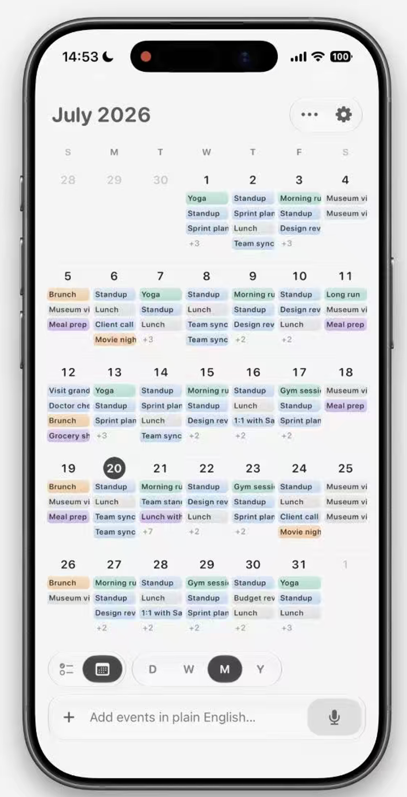
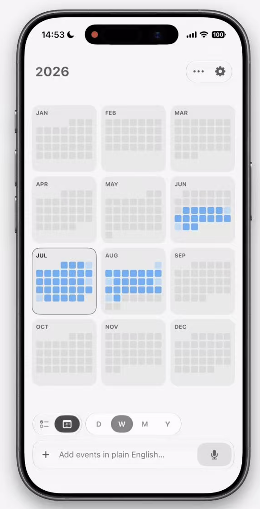

# Timia iOS 日程页重构方案

> 方案日期：2026-07-30
> 状态：待确认，尚未进入代码开发
> 适用范围：Timia iOS 日程页
> 日模式参考：[calendar-day-layout-reference.png](assets/calendar-day-layout-reference.png)
> 月模式参考：[calendar-month-layout-reference.png](assets/calendar-month-layout-reference.png)
> 年模式参考：[calendar-year-layout-reference.png](assets/calendar-year-layout-reference.png)

## 1. 页面总体结构

页面由三个稳定区域组成：

1. 固定顶部：日期标题、用户头像。
2. 中部内容：根据 Todo/日历及日/周/月/年组合切换。
3. 固定底部：模式切换器、时间范围切换器、自然语言输入框。

建议使用两个互相独立的状态：

```swift
enum ScheduleContentMode {
    case todo
    case calendar
}

enum ScheduleRange {
    case day
    case week
    case month
    case year
}
```

所有模式共用同一个 `selectedDate`。切换模式时保留日期上下文，不自动跳回今天。

## 2. 顶部区域

### 日期标题

- 日、周、月模式：显示 `yyyy年MM月`。
- 年模式：建议显示 `yyyy年`，避免在12个月概览中产生错误的单月语义。
- 左右切换日期范围后，标题同步更新。

### 用户头像

- 当前用户没有头像URL时，显示姓名首字母头像。
- 点击头像切换到现有“我的”Tab。
- 不在日程页内重复创建个人资料页面。

## 3. 月模式



### 布局

- 顶部为星期标题，一屏显示7列。
- 月份主体显示5或6周，根据月份实际跨度自适应。
- 每个日期格包含日期数字和任务摘要。
- 相邻月份日期使用低对比度文字。
- 当前选中日期使用实心圆背景。
- 当前日期与选中日期需要区分：今天使用描边或主题色文字，选中日期使用实心背景。
- 底部固定操作区不覆盖最后一周。

### 任务摘要

- 每天优先展示3条任务，小屏最多2条，大屏最多4条。
- 任务显示单行标题，使用项目色、任务色或优先级色的低饱和背景。
- 超出数量显示 `+N`。
- 同一个跨日任务可以在连续日期中显示为连续色带，但不得破坏7列等宽布局。
- 已完成任务降低不透明度，不使用删除线挤压有限空间。

### 交互

- 左右滑动切换上月、下月。
- 点击日期标题切换到该日期的日模式。
- 点击任务打开任务详情。
- 点击日期格空白区域，在该日期创建任务。
- 下拉刷新当前月份。
- 切换月份时预取相邻月份，降低翻页等待。

### 与现有月模式的关系

保留现有数据和任务段计算逻辑，视觉层重排为参考图的紧凑月视图；任务详情、创建、刷新等已有能力不回退。

## 4. 年模式



### 布局

- 一屏显示12个月，采用3列 × 4行。
- 每个月是独立圆角卡片。
- 卡片左上角显示中文月份，如 `1月`、`2月`。
- 卡片内部显示迷你日历热度图，不显示任务标题。
- 无任务日期使用浅灰。
- 有任务日期使用主题色强度表达任务数量。
- 当前选中月份增加描边。
- 今天所在日期使用更深一级颜色或小描边。

### 热度等级

建议按任务数量分4级：

| 当日任务数 | 表现 |
|---:|---|
| 0 | 浅灰 |
| 1 | 主题色20% |
| 2–3 | 主题色45% |
| 4–5 | 主题色70% |
| 6及以上 | 主题色100% |

热度只表达数量，不混用任务优先级颜色，避免12个月概览过于杂乱。

### 交互

- 上下或左右翻页切换上一年、下一年，优先采用左右分页以保持与其他模式一致。
- 点击月份进入该月的月模式。
- 长按月份可显示该月任务总数、完成数和待办数，但首版可以不做。
- 年模式底部切换器必须正确选中 `年`。

### 参考图修正

参考图展示的是年视图，但底部高亮了 `W`。实现时不沿用这个不一致状态，应高亮 `年`。

### 数据接口

当前接口只支持 `day/week/month`。年模式不建议由客户端并发请求12个月，应扩展后端为年度摘要：

```text
GET /views/schedule/calendar?scope=me&view=year&anchor=2026-07-30
```

响应建议包含：

```text
year
months[]
  month
  task_count
  todo_count
  done_count
  days[]
    key
    task_count
```

这样一次请求即可绘制12个月热度图，并避免重复传输完整任务详情。

## 5. 日、周模式衔接

### 日模式

- 顶部显示当前周7天日期选择器。
- 中部一次只显示一个日期的全天任务和时间轴。
- 左右滑动切换前一天、后一天。
- 日期栏固定；全天任务随时间轴上下滚动。
- 左侧时间刻度只参与纵向同步，不参与日期横向分页。

### 周模式

- 一屏显示完整7列，不允许横向滚动查看剩余日期。
- 左侧使用紧凑时间刻度。
- 日期表头固定，全天任务随时间轴滚动。
- 任务卡片在空间不足时只显示标题。
- 点击任务进入详情。
- 左右滑动切换上一周、下一周。

## 6. Todo模式

Todo与日历共用同一组任务和日期范围：

- Todo + 日：当前日期任务。
- Todo + 周：当前周任务。
- Todo + 月：当前月任务。
- Todo + 年：当前年任务，可在年度接口完成后开放。

列表按状态分组：

1. 待办
2. 进行中
3. 已完成
4. 已归档

默认展开待办和进行中，完成和归档默认折叠。

## 7. 底部操作区

底部固定区域包含：

1. Todo/日历模式切换器。
2. 日/周/月/年时间范围切换器。
3. 自然语言输入框。

推荐使用 `safeAreaInset(edge: .bottom)`，让中部内容自动避让，而不是直接遮盖任务。

输入框结构：

- 左侧新增按钮。
- 中间自然语言文本输入。
- 右侧发送或麦克风按钮。
- 键盘弹出时输入框随键盘上移。
- 模式切换器可保持显示，不随键盘进入时间轴。

## 8. 自然语言自动解析

### 目标

支持输入：

- `明天下午3点开产品会议，持续1小时`
- `周五完成月度报告，优先级高`
- `8月12日在上海拜访客户`
- `下周一上午把设计稿评审安排到产品项目`

系统自动解析：

- 标题
- 日期
- 开始时间
- 结束时间或持续时长
- 全天状态
- 优先级
- 状态
- 地点
- 空间与项目
- 参与人或负责人

### 交互闭环

1. 用户输入自然语言。
2. 点击发送，输入框进入解析状态。
3. 服务端返回结构化任务草稿。
4. 页面在输入框上方显示解析确认卡。
5. 用户检查日期、时间、项目等关键信息。
6. 点击“创建”后调用现有任务创建接口。
7. 点击“编辑”进入完整任务编辑页。
8. 创建成功后刷新当前日历或Todo列表。

不建议模型解析后直接无确认创建，避免相对日期、项目名称或时间范围被误解。

### 解析确认卡

确认卡至少显示：

- 任务标题
- 日期与时间
- 空间 / 项目
- 优先级
- 解析假设或缺失字段
- `编辑`、`创建`两个操作

如果存在歧义，例如“下周找小王聊一下”，确认卡需要明确提示：

- 没有具体日期或时间
- 匹配到多个“小王”
- 没有指定项目

### 默认规则

- 解析相对时间时使用用户当前时区。
- 没有日期时，默认使用日程页当前选中日期，并在确认卡标记为系统补充。
- 有时间但没有持续时长时，默认1小时。
- 有日期但没有时间时，按全天任务处理。
- 没有状态时默认 `todo`。
- 没有优先级时默认低优先级。
- 空间或项目无法唯一确定时，必须让用户选择，不能猜测。
- 当前数据模型不支持重复规则；遇到“每天、每周”等表达时提示暂不支持，不能静默忽略。

## 9. 自然语言解析接口

新增预览接口，模型只负责解析，不直接写数据库：

```text
POST /views/schedule/natural-language/parse
```

请求建议：

```json
{
  "text": "明天下午3点开产品会议，持续1小时",
  "timezone": "Asia/Shanghai",
  "reference_time": "2026-07-30T11:00:00+08:00",
  "selected_date": "2026-07-30"
}
```

响应建议：

```json
{
  "draft": {
    "title": "产品会议",
    "start_at": "2026-07-31T15:00:00+08:00",
    "end_at": "2026-07-31T16:00:00+08:00",
    "all_day": false,
    "status": "todo",
    "priority": "1",
    "location": null,
    "workspace_id": null,
    "project_id": null
  },
  "confidence": 0.94,
  "assumptions": [],
  "missing_fields": ["workspace_id", "project_id"],
  "ambiguities": []
}
```

确认后仍调用现有项目任务创建接口，继续执行现有权限校验。

### 服务端约束

- 模型密钥只能放在服务端。
- 模型输出必须经过Pydantic结构校验。
- 日期范围、状态和优先级必须二次校验。
- 空间、项目、成员必须根据当前用户权限匹配。
- 不把完整任务库发送给模型，只提供解析所需的候选名称。
- 增加超时、限流和错误重试。
- 解析失败时保留原输入，允许进入手动任务编辑页。

### 语音输入

参考图包含麦克风。建议语音只负责转写文本，转写结果继续走同一个自然语言解析接口：

```text
语音 → 文本 → 结构化解析 → 确认卡 → 创建
```

这样文本和语音不会维护两套任务解析逻辑。

## 10. 加载与错误状态

- 日、周、月、年数据分别缓存。
- 相邻日期范围提前预取。
- 模式切换时保留各自滚动位置。
- 首次加载使用局部骨架，不遮挡整个页面。
- 普通错误继续使用屏幕中央Tip并自动消失。
- 自然语言解析错误显示在输入框附近，同时保留用户输入。
- 网络请求取消不作为用户可见错误。

## 11. 开发阶段

### 阶段一：页面骨架

- 顶部年月/年份标题与头像。
- 底部两组切换器。
- 自然语言输入框外观与键盘行为。
- 统一日期状态。

### 阶段二：日、周

- 单日日历时间轴。
- 7天周视图。
- 滑动、固定和同步滚动。

### 阶段三：月

- 参考图紧凑月视图。
- 任务摘要、`+N`、跨日任务和日期跳转。

### 阶段四：年

- 后端年度摘要接口。
- 12个月热度图。
- 年/月跳转。

### 阶段五：Todo

- 按日、周、月、年筛选。
- 状态分组和任务详情。

### 阶段六：自然语言解析

- 服务端解析接口。
- iOS解析确认卡。
- 权限候选匹配。
- 确认创建与手动编辑回退。
- 可选语音转写。

### 阶段七：验证

- iOS Debug与Release构建。
- 小屏、标准屏和大屏布局。
- 深色模式、Dynamic Type和VoiceOver。
- 日期边界、跨月、跨年和时区测试。
- 模型歧义、解析失败和权限不足测试。

## 12. 验收标准

- 日、周、月、年切换器状态与内容一致。
- 年视图必须高亮“年”，不复刻参考图中的错误状态。
- 日、周、月标题为 `yyyy年MM月`，年视图标题为 `yyyy年`。
- 月视图一屏展示完整月份，任务过多时显示 `+N`。
- 年视图一屏展示12个月，并正确反映每日任务数量。
- 点击年视图月份可以进入对应月视图。
- 自然语言可以正确处理中文相对日期和时间。
- 解析结果经过确认后才创建任务。
- 无法唯一确定空间、项目或成员时不自动猜测。
- 解析失败不丢失输入内容。
- 底部操作区不遮挡日历或Todo最后一项。
