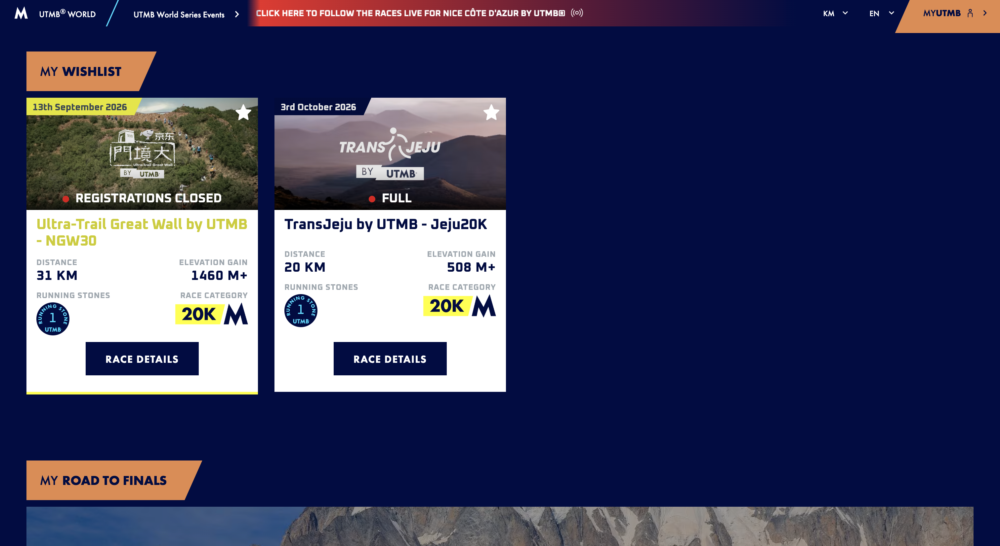

# Web 页面风格特征

> 整理日期：2026-09-26
> 用途：Timia Web 视觉增强的对照底稿。
> 落地：`/my/schedule` 已使用 `appearance="stage"`。台面是 `stage`（`#020C41`），面板是墨线白纸，分区是靛蓝斜切缎带。项目页日程仍是 `plain`。
> 色值：截图色由像素取样，登录窗口色以 `codes/web` 的 token 与类名为准。截图经过压缩，细线和抗锯齿边缘会偏脏，大色块以重复取样为准。

阅读判断：这是日常计划产品的保留式整理。语言沿用登录页已经成立的暖纸插画、墨线窗口、单一靛蓝。截图贡献的是赛事看板的结构，深色台面、缎带分区、白卡片、指标排版。

三档刻度（布局变化 / 动效 / 信息密度，1 到 10）：

| 表面 | 变化 | 动效 | 密度 | 依据 |
|---|---:|---:|---:|---|
| 截图赛事看板 | 6 | 2 | 5 | 斜切缎带和照片头打破对称，画面本身静止，卡片信息中等 |
| 登录页 | 4 | 3 | 3 | 插画承担变化，窗口居中安静，只有焦点环和按压缩放 |
| 应用壳现状 | 3 | 2 | 6 | 浅色对称壳层，日程和健康页偏密 |
| 下一轮建议：登录与注册 | 4 | 3 | 3 | 与现登录页对齐 |
| 下一轮建议：计划、空间等集合页 | 5 | 3 | 5 | 借用截图的卡片解剖，密度不升到驾驶舱 |
| 下一轮建议：日程与健康 | 3 | 2 | 7 | 时间轴和指标表保持可读，不套营销缎带 |

判断依据来自 taste skill 的 brief inference 与 redesign protocol：品牌色、信息架构、文案语气先保留，再决定哪些结构可以搬。该 skill 的落地页规则不覆盖日程这种密集产品界面，所以日程页不按落地页刻度处理。

## 1. 截图：赛事看板

参考图：



页面是 UTMB World 的 My Wishlist。右侧大片留白是深色台面本身，内容靠左成组。

### 1.1 垂直结构

```text
顶栏（字标、主导航、语言、账户）
整宽通知条
斜切分区缎带（MY WISHLIST）
等宽白色赛事卡横排
斜切分区缎带（MY ROAD TO FINALS）
底部全宽摄影带
```

顶栏很薄，贴在台面上，没有单独的白底壳。通知条是唯一的整宽色带，文案全大写、居中、字距紧。分区标题不是灰字标签，而是一块从左缘伸出的色带，右端切成斜角。卡片在色带下方横向排列，高度对齐，按钮落在同一条基线上。

### 1.2 取样色

| 角色 | 取样 | 在画面里的作用 |
|---|---|---|
| 台面、标题字、主按钮 | `#020C41` | 同一支海军蓝同时做背景、标题和按钮，白卡片才是被照亮的一层 |
| 顶栏右侧洗色 | `#4C1D3C` 到 `#B53332` | 顶栏从海军蓝扫向洋红与红，不是第二条导航底 |
| 通知条 | `#68223A` 到 `#B53332` | 整宽红色渐变，白字 |
| 分区缎带、账户按钮 | `#D98D57` | 暖陶橙，扁平台，右端斜切 |
| 日期条、卡片底边、距离徽章 | `#E0E048` 到 `#F8F850` | 黄绿强调，只出现在媒体和徽章上 |
| 卡片纸面 | `#FFFFFF` | 唯一大面积亮面 |
| 指标标签 | `#98A0A8` | 小字、正字距 |
| 状态点 | `#C82820` | 圆点加短标签，贴在照片下沿 |

橙和黄是这张截图的品牌色，不是 Timia 的品牌色。结构可以学，色板不搬。

### 1.3 卡片解剖

单卡从上到下：

1. 照片头，约占卡片上半。左上是日期条，右上是线框星标。照片下沿是状态：色点加全大写短句。
2. 标题，海军蓝、重字重，两行内能读完。
3. 两列指标。每列是一行灰色小标签，下面一行重数字，如距离、爬升。
4. 类别徽章横排，图形标记加重数字。
5. 主按钮贴底，海军蓝底、白字、短标签、几乎直角。多卡并排时按钮对齐。

第一张卡的底边还有一条黄线，用来和纯白卡区分，属于强调而不是每张卡的默认描边。

### 1.4 排版与形状

- 分区、状态、按钮用紧缩的全大写。标题用重字重的句子式名称。
- 指标的层次靠「小标签 + 大数字」，不靠彩色图标。
- 卡片和按钮的圆角很紧，接近直角。斜切只出现在缎带和账户按钮上，是这套界面的签名形状。
- 阴影很弱。层次来自「深台面 / 白纸 / 色带」三层，不来自投影。
- 摄影负责情绪，色块负责导航。没有玻璃拟态，没有渐变按钮。

## 2. Timia 登录页

背景文件：`codes/web/public/login/background_2k.png`（页面使用 2K；同目录还有 `background.png` 与 `background_4k.png`）。生成说明在 `codes/web/public/login/prompt.txt`。窗口实现在 `codes/web/app/login/page.tsx`。

### 2.1 背景图

整屏铺满，`bg-cover bg-center`，窗口不透明，插画只出现在窗口四周。

- 风格：长场线稿加选择性平涂。粗黑轮廓，线略有手绘断口，服装、工具、肤色、环境物填实色。无渐变、无阴影、无体积光。
- 纸色：留白取样约 `#F8F3EA`、`#F4F1E7`、`#FCF7EA`，暖米纸，不是纯白，也不是灰。
- 构图：约 200 个职业人物散在整个 16:9 画面里，不排网格。边缘有店面、路灯、树、摊位形成一圈环境，中间有的人物背后有小物件，有的只剩纸色。
- 角色：肤色在画面里均匀分布。每个职业有自己的服装色和工具，用来在密人群里互相分开。
- 密度：从边到边都有内容，没有大块空地。这是气氛层，不是信息层。

这张图已经是品牌资产。应用内页不要换成库存风景，也不要改成截图那种纯海军蓝空台。

### 2.2 登录窗口

窗口是插画上面的一张纸，用墨线把纸和插画分开。

| 属性 | 实现 | 值 |
|---|---|---|
| 位置 | 垂直水平居中 | `min-h-screen`，主列 `max-w-[440px]` |
| 纸面 | `bg-surface` | `#FFFFFF` |
| 边 | `border-4 border-black` | 4px `#000000`，对齐插画的墨线 |
| 圆角 | `rounded-xl` | 主题里是 `0.5rem`，即 8px |
| 阴影 | `shadow-sm` | 边缘靠黑框，阴影只做一点厚度 |
| 内边距 | `p-xl` | 20px |
| 字标 | Epilogue 40px / semibold / tracking-tight | 颜色 `on-surface` `#1B1B23` |
| 副题 | `text-caption` | 12px，`text-secondary` `#6B6B6B`，居中 |
| 输入 | `bg-surface-bright`，`border-border-subtle`，`rounded-xl` | 底 `#FCF8FF`，边 `#E8E8EC` |
| 标签 | 浮动标签 | 未聚焦居中，聚焦后收到上沿，变成 12px |
| 图标 | Material Symbols Outlined | 贴在输入右侧，聚焦时变为 `primary` |
| 焦点 | `focus:border-primary focus:ring-4 focus:ring-primary/10` | 主色 `#4648D4` |
| 主按钮 | 通栏 `bg-primary` | 字 `on-primary`，`active:scale-95`，禁用 `opacity-50` |
| 次链接 | `text-primary`，字重 semibold | 悬停下划线 |
| 错误 | `text-small text-error` | `#EF4444`，行内，不用弹窗 |
| 会话提示 | 琥珀底 | `amber-50` / `amber-200`，这是状态色，不是品牌色 |
| 页脚 | 绝对贴底 | `text-overline` 11px，颜色 `outline-variant` `#C7C4D7`，直接放在插画上 |

窗口里只有一个强调色：靛蓝。黑框是结构，不是第二强调色。

主题圆角有一处需要单独记住：`rounded-full` 在 `tailwind.config.js` 里被收成 `0.75rem`（12px），不是胶囊。登录窗口用的是 8px 的 `rounded-xl`。小于等于 24px 的方块配 `rounded-full` 才会变成圆。

### 2.3 注册页和登录页不是同一套窗口

`codes/web/app/register/page.tsx` 仍是点阵底加淡紫渐变，卡片是 `border-border-subtle` 的细边，没有黑框，也没有职业插画。登录页规范里的「营销区用 dot-grid」描述的是注册页，不是当前登录页。

下一轮若统一认证表面，以登录页为准：同一张背景、同一套 4px 黑框、同一套浮动标签和通栏主按钮。注册页字段更多，窗口可以加高，宽度仍保持 440px。

## 3. 应用壳现状（对照）

壳层代码和 `.cursor/rules/ui-interaction-design.mdc` 有出入，整理时以代码为准。

- 顶栏实际高度约 34px，`bg-white/80 backdrop-blur-md`，底边 `border-gray-200`。规范文本仍写 `h-14`。
- 侧栏实际宽 64px（`w-16`），白底，图标导航。规范文本仍写 `w-48`。
- 页面底 `#FAFAFA`，卡片白底加 `border-border-subtle`，主按钮靛蓝。
- 浮动按钮是 48px 的 `rounded-full`。按当前 token，这是 12px 圆角的方块，不是正圆。
- 字族已定：标题 Epilogue，正文 Be Vietnam Pro，代码 JetBrains Mono。中文界面走 `next-intl`，产品名 Timia 不译。

应用壳是浅色、低变化、中高密度。它和登录页共享靛蓝与字族，不共享台面和墨线窗口。

## 4. 合成后的用法

下一轮增强按「保留品牌、搬结构」执行。信息架构、路由、导航文案、表单字段顺序不动。

### 4.1 从登录页沿用

- 认证页的台面继续用职业插画，纸色暖米，线稿平涂。
- 聚焦面板用墨线窗口：白纸、4px 黑框、8px 圆角、弱阴影、宽 440px。
- 字标用 Epilogue，收字距。正文继续 Be Vietnam Pro。
- 唯一品牌强调色保持 `primary` `#4648D4`。焦点环保持 `primary/10`。
- 主操作通栏或明确的实心按钮，按下 `scale-95`。错误仍行内。

### 4.2 从截图搬结构

这些形状用 Timia 的纸色、墨色、靛蓝重画，不用截图的橙、黄、红做品牌色。

- 分区标题可以做成贴边的短色带，右端斜切。色带用 `on-surface` 或 `primary`，字用浅色。一根页面里的装饰色带控制在分区级，不落到每张卡。
- 集合页卡片分成三段：头图或色块头、名称、指标区，主动作贴底并对齐。
- 指标用「11px 正字距标签 + 重数字」。数字启用表格数字，避免列表上下跳动。
- 状态用色点加短标签，贴在头图下沿。红点和琥珀底只表示状态。
- 多卡横排时按钮落在同一基线。
- 层次优先用台面和纸面的对比，少加投影。

### 4.3 不搬

- 不把应用日常底色改成 `#020C41`。登录插画的纸色和长时间阅读都吃不消一块纯海军蓝。
- 不引入 `#D98D57` 作为第二品牌色。截图的橙、黄、洋红渐变留在参考图里。
- 不把 Epilogue 换成紧缩全大写运动字体。中文界面保持句子式标题。
- 不在日程时间轴、健康表格上加斜切缎带和照片头。那两处保持高密度。
- 不把登录窗口改成玻璃拟态或深色卡片。黑框白纸是它和插画的分界。
- 不改路由、主导航文案、登录字段顺序。

### 4.4 建议落到 token 的对应

实现时继续用现有主题名，不在单页写死新色。

| 截图里的角色 | Timia 里用 |
|---|---|
| 深色台面 | 仅认证页使用插画。应用页保持 `bg-background` |
| 白卡片 | `bg-surface`，需要墨线时用 `border-4 border-black`，普通列表卡仍用 `border-border-subtle` |
| 陶橙缎带 | `bg-on-surface` 或 `bg-primary`，二选一，全站锁死一种 |
| 黄绿徽章 | 不新增。数量强调用 `text-on-surface` 重字重 |
| 海军蓝按钮 | `bg-primary text-on-primary` |
| 红色状态点 | 已有 `error` |
| 灰色指标标签 | `text-overline text-neutral-muted` 或 `text-text-secondary` |

墨线窗口（黑框）留给认证页和少量模态。列表卡如果全部改成 4px 黑框，会和插画的线抢，也会把密度打爆。

## 5. 本轮明确不做

- 不改 `codes/web` 的页面、样式和 token。
- 不替换登录背景，不重绘插画。
- 不把规范文件里的壳层尺寸整段改写。尺寸漂移记在第 3 节，等真正改壳层时一起处理。
