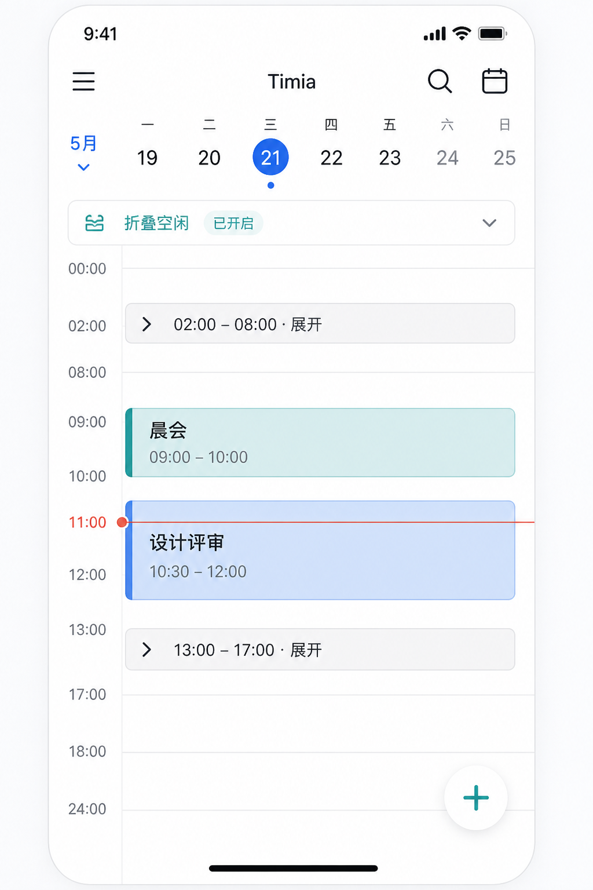
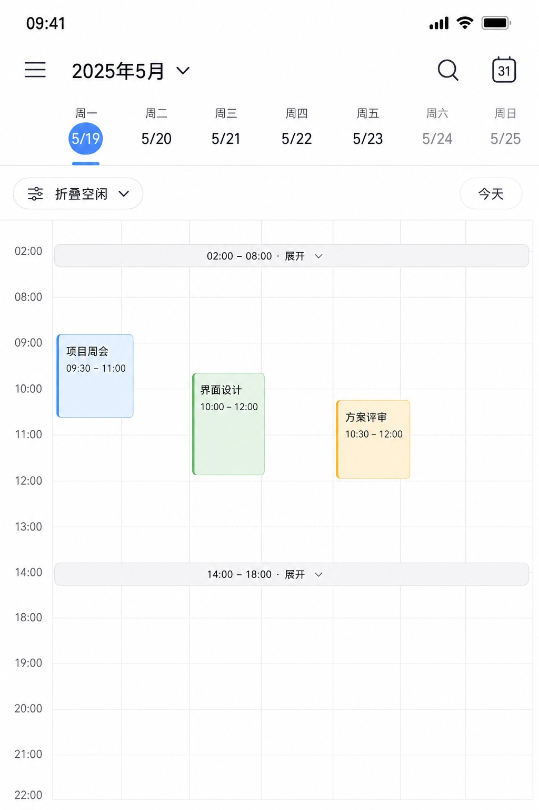
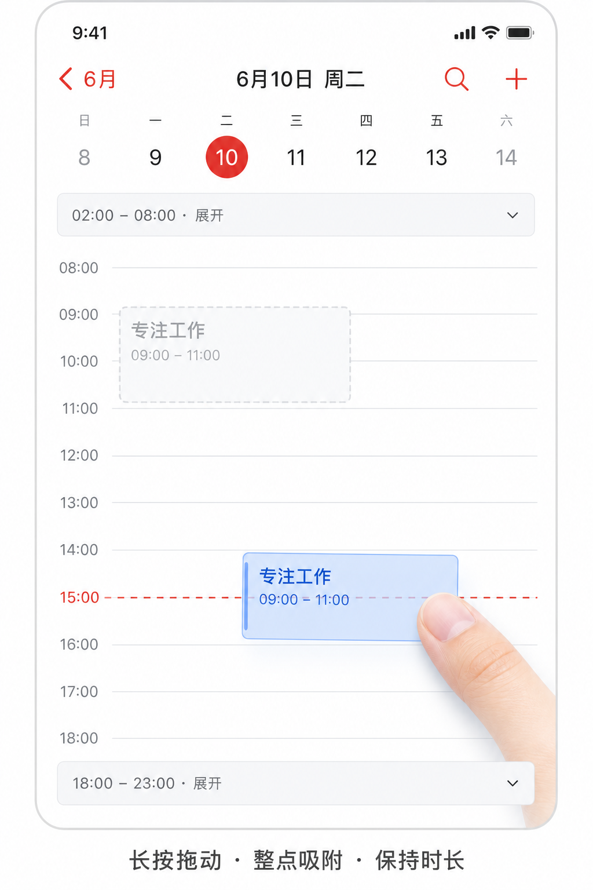
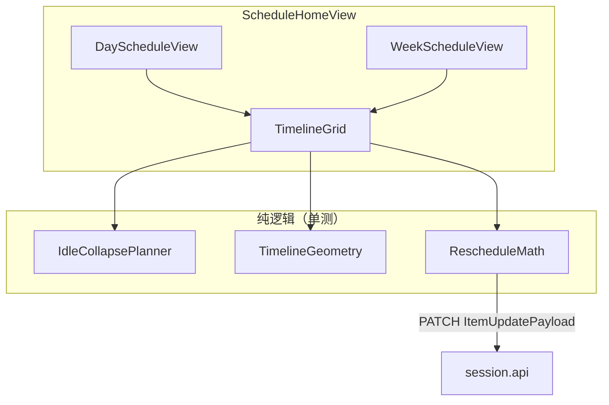
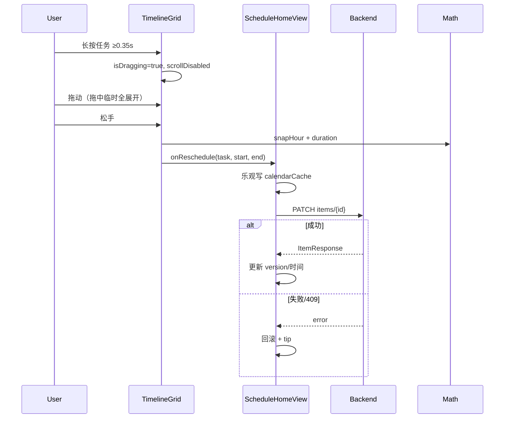

# iOS 日/周时间轴：空闲折叠 + 任务拖拽改期 — Implementation Plan

> **For agentic workers:** REQUIRED SUB-SKILL: Use `superpowers:subagent-driven-development` (recommended) or `superpowers:executing-plans` to implement this plan task-by-task. Steps use checkbox (`- [ ]`) syntax for tracking.

**Goal:** 在 iOS 日历日/周模式的 `TimelineGrid` 上支持（1）≥2h 空闲自动折叠与展开入口；（2）长按拖拽定时任务改期（整点 snap、保时长）。

**Architecture:** 抽出纯逻辑 `IdleCollapsePlanner` / `TimelineGeometry` / `RescheduleMath`（可单测）；`TimelineGrid` 全部坐标经几何映射；折叠状态仅用 `UserDefaults` 顶栏总开关（无逐段展开）；拖拽经长按+Drag，松手后乐观更新日历 cache 并 `PATCH` `ItemUpdatePayload`。

**Tech Stack:** SwiftUI (iOS 17+)、XCTest（`TimiaTests`）、现有 `session.api.request` PATCH、XcodeGen `project.yml`（folder sources，新 Swift 文件自动入 target）。

**Spec:** `docs/technical-solution/ios-calendar-day-week-drag-collapse.md`（2026-09-06 已拍板）

## Global Constraints

- 折叠阈值：**≥ 120 分钟**；默认 **自动折叠**；周模式 **七天 busy 并集对齐**
- 拖拽 snap：**整点（60 分钟）**（对齐 Web）；点空白新建仍 **15 分钟**
- **不做**：全天拖拽、resize 时长、月/年视图、Web 折叠
- 可拖：`status ∈ {todo, doing, done}` 且非全天且有 `startAt`；`archived` 不可拖
- 保时长：`newEnd = newStart + (oldEnd - oldStart)`（缺 end 按 60min）；允许跨日
- 算法文件放 `codes/mobile/ios/Timia/Features/Schedule/`；单测放 `codes/mobile/ios/TimiaTests/`
- 主 UI 仍改 `ScheduleHomeView.swift` 内 `TimelineGrid` / day-week sections；避免改遗留 `ScheduleView.swift`

---

## 改动后示意图

### 日模式 — 空闲折叠



要点：最上方「折叠空闲/展开全部」总开关；大段空闲收成不可点的压缩条（可显示 `02:00 – 08:00`）；有任务时段正常展开；今日保留当前时间线。

### 周模式 — 并集对齐折叠



要点：七天共用同一套折叠条 y（并集 busy）；仅「七天都空」的 ≥2h 段折叠。

### 日模式 — 长按拖拽改期



要点：长按后 ghost 跟随；落点 **整点** 吸附线；原位可留虚影；拖拽中临时强制展开全部。

### 结构示意





---

## File map

| File | Role |
|------|------|
| **Create** `codes/mobile/ios/Timia/Features/Schedule/IdleCollapsePlanner.swift` | busy/idle、≥2h 阈值、今日保护、周并集 |
| **Create** `codes/mobile/ios/Timia/Features/Schedule/TimelineGeometry.swift` | visible/collapsed segments、`y↔minutes`、`contentHeight` |
| **Create** `codes/mobile/ios/Timia/Features/Schedule/RescheduleMath.swift` | 整点 snap、保时长、ISO 字符串 |
| **Create** `codes/mobile/ios/TimiaTests/IdleCollapsePlannerTests.swift` | 折叠规划单测 |
| **Create** `codes/mobile/ios/TimiaTests/TimelineGeometryTests.swift` | 几何往返单测 |
| **Create** `codes/mobile/ios/TimiaTests/RescheduleMathTests.swift` | 改期计算单测 |
| **Modify** `codes/mobile/ios/Timia/Features/Schedule/ScheduleHomeView.swift` | `TimelineGrid` 接几何/折叠条/拖拽；day/week section 接开关；`rescheduleCalendarTask` |
| **Reference** `docs/technical-solution/web-calendar-item-drag.md` | Web 语义对齐 |
| **Reference** `docs/technical-solution/ios-calendar-day-week-drag-collapse.md` | 产品拍板 |

---

### Task 1: `IdleCollapsePlanner` + 单测

**Files:**
- Create: `codes/mobile/ios/Timia/Features/Schedule/IdleCollapsePlanner.swift`
- Test: `codes/mobile/ios/TimiaTests/IdleCollapsePlannerTests.swift`

**Interfaces:**
- Produces:
  - `struct MinuteRange: Equatable { var start: Int; var end: Int }` // end exclusive, minutes in [0, 1440]
  - `enum IdleCollapsePlanner`
  - `static func busyRanges(from placements: [(startMinutes: Int, durationMinutes: Int)]) -> [MinuteRange]`
  - `static func idleRanges(busy: [MinuteRange], dayMinutes: Int = 1440) -> [MinuteRange]`
  - `static func collapsibleIdles(idle: [MinuteRange], thresholdMinutes: Int = 120) -> [MinuteRange]`
  - `static func protectNow(idles: [MinuteRange], nowMinutes: Int?, padMinutes: Int = 30) -> [MinuteRange]`
  - `static func unionBusy(_ days: [[MinuteRange]]) -> [MinuteRange]`

- [ ] **Step 1: Write failing tests**

```swift
import XCTest
@testable import Timia

final class IdleCollapsePlannerTests: XCTestCase {
    func testBusyMergesOverlap() {
        let busy = IdleCollapsePlanner.busyRanges(from: [
            (startMinutes: 9 * 60, durationMinutes: 90),
            (startMinutes: 10 * 60, durationMinutes: 60),
        ])
        XCTAssertEqual(busy, [MinuteRange(start: 540, end: 660)])
    }

    func testCollapsibleOnlyWhenAtLeastTwoHours() {
        let idle = [
            MinuteRange(start: 0, end: 90),
            MinuteRange(start: 200, end: 400),
        ]
        let gaps = IdleCollapsePlanner.collapsibleIdles(idle: idle, thresholdMinutes: 120)
        XCTAssertEqual(gaps, [MinuteRange(start: 200, end: 400)])
    }

    func testProtectNowSplitsContainingIdle() {
        let idles = [MinuteRange(start: 0, end: 12 * 60)]
        let protected = IdleCollapsePlanner.protectNow(idles: idles, nowMinutes: 3 * 60, padMinutes: 30)
        // 02:30–03:30 不得落在可折叠段内
        XCTAssertFalse(protected.contains { $0.start <= 150 && $0.end >= 210 && ($0.end - $0.start) >= 120 })
    }

    func testWeekUnionBusy() {
        let mon = [MinuteRange(start: 9 * 60, end: 10 * 60)]
        let wed = [MinuteRange(start: 14 * 60, end: 15 * 60)]
        let union = IdleCollapsePlanner.unionBusy([mon, [], wed, [], [], [], []])
        XCTAssertEqual(union, [
            MinuteRange(start: 540, end: 600),
            MinuteRange(start: 840, end: 900),
        ])
    }
}
```

- [ ] **Step 2: Run tests — expect fail**

```bash
cd codes/mobile/ios && xcodebuild test -scheme Timia -destination 'platform=iOS Simulator,name=iPhone 16' -only-testing:TimiaTests/IdleCollapsePlannerTests
```

Expected: compile error / fail（类型未定义）

- [ ] **Step 3: Implement planner**

```swift
import Foundation

struct MinuteRange: Equatable, Hashable, Sendable {
    var start: Int
    var end: Int // exclusive
    var duration: Int { end - start }
}

enum IdleCollapsePlanner {
    static func busyRanges(from placements: [(startMinutes: Int, durationMinutes: Int)]) -> [MinuteRange] {
        let sorted = placements
            .map { MinuteRange(start: max(0, $0.startMinutes), end: min(1440, $0.startMinutes + max(0, $0.durationMinutes))) }
            .filter { $0.end > $0.start }
            .sorted { $0.start < $1.start }
        guard var current = sorted.first else { return [] }
        var result: [MinuteRange] = []
        for next in sorted.dropFirst() {
            if next.start <= current.end {
                current.end = max(current.end, next.end)
            } else {
                result.append(current)
                current = next
            }
        }
        result.append(current)
        return result
    }

    static func idleRanges(busy: [MinuteRange], dayMinutes: Int = 1440) -> [MinuteRange] {
        var cursor = 0
        var idles: [MinuteRange] = []
        for b in busy.sorted(by: { $0.start < $1.start }) {
            if b.start > cursor { idles.append(MinuteRange(start: cursor, end: b.start)) }
            cursor = max(cursor, b.end)
        }
        if cursor < dayMinutes { idles.append(MinuteRange(start: cursor, end: dayMinutes)) }
        return idles
    }

    static func collapsibleIdles(idle: [MinuteRange], thresholdMinutes: Int = 120) -> [MinuteRange] {
        idle.filter { $0.duration >= thresholdMinutes }
    }

    /// 从可折叠列表中剔除覆盖 [now-pad, now+pad] 的部分（拆段）。
    static func protectNow(idles: [MinuteRange], nowMinutes: Int?, padMinutes: Int = 30) -> [MinuteRange] {
        guard let now = nowMinutes else { return idles }
        let protect = MinuteRange(start: max(0, now - padMinutes), end: min(1440, now + padMinutes))
        return idles.flatMap { gap -> [MinuteRange] in
            let overlapStart = max(gap.start, protect.start)
            let overlapEnd = min(gap.end, protect.end)
            guard overlapStart < overlapEnd else { return [gap] }
            var parts: [MinuteRange] = []
            if gap.start < overlapStart { parts.append(MinuteRange(start: gap.start, end: overlapStart)) }
            if overlapEnd < gap.end { parts.append(MinuteRange(start: overlapEnd, end: gap.end)) }
            return parts
        }
    }

    static func unionBusy(_ days: [[MinuteRange]]) -> [MinuteRange] {
        busyRanges(from: days.flatMap { day in day.map { (startMinutes: $0.start, durationMinutes: $0.duration) } })
    }
}
```

- [ ] **Step 4: Re-run tests — expect pass**

- [ ] **Step 5: Commit**

```bash
git add codes/mobile/ios/Timia/Features/Schedule/IdleCollapsePlanner.swift \
        codes/mobile/ios/TimiaTests/IdleCollapsePlannerTests.swift
git commit -m "feat(ios): add IdleCollapsePlanner for timeline empty gaps"
```

---

### Task 2: `TimelineGeometry` + 单测

**Files:**
- Create: `codes/mobile/ios/Timia/Features/Schedule/TimelineGeometry.swift`
- Test: `codes/mobile/ios/TimiaTests/TimelineGeometryTests.swift`

**Interfaces:**
- Consumes: `MinuteRange`, collapsible idles from Task 1
- Produces:
  - `enum TimelineSegment: Equatable { case visible(MinuteRange); case collapsed(MinuteRange) }`
  - `struct TimelineGeometry`
  - `init(dayMinutes:collapsibleIdles:hourHeight:collapsedHeight:collapseEnabled:)`
  - `var contentHeight: CGFloat`
  - `func y(forMinutes: Int) -> CGFloat`
  - `func minutes(atY: CGFloat) -> Int`
  - `func height(forDurationMinutes: Int, startingAt: Int) -> CGFloat`
  - `var segments: [TimelineSegment]`

- [ ] **Step 1: Write failing tests**

```swift
func testFullDayVisibleHeight() {
    let g = TimelineGeometry(
        collapsibleIdles: [],
        hourHeight: 74,
        collapsedHeight: 28,
        collapseEnabled: true
    )
    XCTAssertEqual(g.contentHeight, 24 * 74, accuracy: 0.1)
}

func testCollapsedGapShrinksHeight() {
    let gap = MinuteRange(start: 0, end: 6 * 60) // 6h → 28pt instead of 6*74
    let g = TimelineGeometry(
        collapsibleIdles: [gap],
        hourHeight: 74,
        collapsedHeight: 28,
        collapseEnabled: true
    )
    let expected = 28 + 18 * 74
    XCTAssertEqual(g.contentHeight, expected, accuracy: 0.1)
}

func testMinutesRoundTripOutsideCollapse() {
    let g = TimelineGeometry(
        collapsibleIdles: [MinuteRange(start: 0, end: 6 * 60)],
        hourHeight: 74,
        collapsedHeight: 28,
        collapseEnabled: true
    )
    let y = g.y(forMinutes: 9 * 60)
    XCTAssertEqual(g.minutes(atY: y), 9 * 60)
}
```

- [ ] **Step 2: Run — expect fail**

- [ ] **Step 3: Implement**

构建 `segments`：从 0…1440 扫描，若 `collapseEnabled` 且命中 collapsible idle → `collapsed`，否则切成 `visible`。  
`y(forMinutes:)` / `minutes(atY:)` 按 segment 累加高度（visible: `duration/60*hourHeight`，collapsed: `collapsedHeight`）。  
落在 collapsed 段的 `minutes(atY:)` 返回该段中点分钟（拖拽中会临时全展开，此值为兜底）。

- [ ] **Step 4: Tests pass**

- [ ] **Step 5: Commit** `feat(ios): add TimelineGeometry for collapsed timeline mapping`

---

### Task 3: `RescheduleMath` + 单测

**Files:**
- Create: `codes/mobile/ios/Timia/Features/Schedule/RescheduleMath.swift`
- Test: `codes/mobile/ios/TimiaTests/RescheduleMathTests.swift`

**Interfaces:**
- Produces:
  - `enum RescheduleMath`
  - `static func snapToHour(_ minutes: Int) -> Int`
  - `static func computeNewRange(originalStart: Date, originalEnd: Date?, dropDay: Date, dropMinutes: Int, calendar: Calendar) -> (start: Date, end: Date)`
  - `static func iso8601(_ date: Date) -> String`（与现有 TaskEditor / ScheduleFormat 风格一致，优先复用已有 formatter）

- [ ] **Step 1: Tests**

```swift
func testSnapToHour() {
    XCTAssertEqual(RescheduleMath.snapToHour(61), 60)
    XCTAssertEqual(RescheduleMath.snapToHour(89), 60)
    XCTAssertEqual(RescheduleMath.snapToHour(90), 120)
}

func testPreservesDurationAcrossDay() {
    var cal = Calendar(identifier: .gregorian)
    cal.timeZone = TimeZone(identifier: "Asia/Shanghai")!
    let start = cal.date(from: DateComponents(year: 2026, month: 9, day: 6, hour: 9))!
    let end = cal.date(from: DateComponents(year: 2026, month: 9, day: 6, hour: 11))!
    let dropDay = cal.date(from: DateComponents(year: 2026, month: 9, day: 7))!
    let result = RescheduleMath.computeNewRange(
        originalStart: start, originalEnd: end, dropDay: dropDay, dropMinutes: 15 * 60, calendar: cal
    )
    XCTAssertEqual(cal.component(.day, from: result.start), 7)
    XCTAssertEqual(cal.component(.hour, from: result.start), 15)
    XCTAssertEqual(result.end.timeIntervalSince(result.start), 2 * 3600)
}
```

- [ ] **Step 2–4: Implement（整点 snap；缺 end → +1h）→ pass → commit**

```bash
git commit -m "feat(ios): add RescheduleMath with hour snap and duration keep"
```

---

### Task 4: 日模式折叠 UI 接入 `TimelineGrid`

**Files:**
- Modify: `codes/mobile/ios/Timia/Features/Schedule/ScheduleHomeView.swift`（`TimelineGrid`、`DayTimelineSection`、`ScheduleHomeView` 状态）

**Interfaces:**
- Consumes: Task 1–2
- Produces: 日模式可见折叠条 + 顶栏开关；新建/当前线走几何

- [ ] **Step 1: 在 `ScheduleHomeView` 增加状态**

```swift
@AppStorage("schedule.idleCollapseEnabled") private var idleCollapseEnabled = true
@State private var dragForcesExpandAll = false // 拖拽中临时全展开
```

有效折叠：`effectiveCollapse = idleCollapseEnabled && !dragForcesExpandAll`

- [ ] **Step 2: 扩展 `TimelineGrid`**

增加参数：`idleCollapseEnabled`、`onToggleCollapseEnabled`（Binding 即可）。**不要**逐段展开回调。

在 `body` 内：

1. 从 timed tasks 的 `ScheduleFormat.placement` 得到 busy → planner → geometry（仅全局 `collapseEnabled`）  
2. 用 `geometry.contentHeight` 替代 `24 * hourHeight`  
3. 小时标签 / 虚线 / 任务 offset / `CurrentTimeLine` 全部改 `geometry.y(forMinutes:)`  
4. 对每个 `collapsed` segment 渲染**不可交互**的 `IdleGapBar`（可显示 `HH:mm – HH:mm`，无展开按钮）  
5. 点空白（非压缩条）：`geometry.minutes(atY:)` 后仍 **15 分钟** snap 新建；点压缩条不新建  
6. **日 section 最上方**加唯一按钮：`idleCollapseEnabled ? "展开全部" : "折叠空闲"`

今日：`protectNow` 使用当前分钟。

- [ ] **Step 3: 手测清单（模拟器）**

- 仅 09:00–10:00 一个任务 → 上下出现压缩条，总高度明显变短  
- 点压缩条 → **不**展开该段  
- 顶栏「展开全部」→ 24h 全高；再「折叠空闲」收起全部空闲  
- 点空白新建时间正确  
- 今日当前红线仍可见  

- [ ] **Step 4: Commit** `feat(ios): collapse idle gaps on day timeline`

---

### Task 5: 周模式并集折叠

**Files:**
- Modify: `ScheduleHomeView.swift`（`WeekTimelineSection` / `TimelineGrid` 多列）

- [ ] **Step 1:** 对 `days` 每列算 busy，再 `unionBusy` → 同一套 `collapsibleIdles` → **一份** `TimelineGeometry` 供七列共用 y。

- [ ] **Step 2:** 压缩条横跨 `labelWidth` 右侧全部 day columns（通栏）；**不可点展开**；顶栏总开关控制整周。

- [ ] **Step 3: 手测**

- 仅周三有会 → 其它公共空闲仍可折；压缩条七列对齐；顶栏开关一次全开/全折  
- 七天都有不同时段任务时，仅真正公共空闲折叠  

- [ ] **Step 4: Commit** `feat(ios): align week timeline idle collapse via union busy`

---

### Task 6: 日模式拖拽改期

**Files:**
- Modify: `ScheduleHomeView.swift`（任务块手势 + `rescheduleCalendarTask`）

**Interfaces:**
- Consumes: Task 3 geometry + math
- Produces: `onReschedule` → PATCH

- [ ] **Step 1: 任务块手势**

对可拖任务（非 archived、非 all-day）：

```swift
LongPressGesture(minimumDuration: 0.35)
  .sequenced(before: DragGesture(minimumDistance: 0, coordinateSpace: .named("timeline")))
```

- 长按成功：`draggingTaskID = task.id`；`scrollDisabled(true)`（外层 ScrollView / section）  
- 拖动：更新 `dragLocation`；进入拖拽时 `dragForcesExpandAll = true`，松手后清回 false  
- 松手：`RescheduleMath.computeNewRange(..., dropMinutes: snapToHour(...))`；若与原时间相同则 no-op；否则 `onReschedule`  
- 位移很小且未进入 drag：视为 tap → `onTaskTap`  
- 拖拽中不触发空白新建  

- [ ] **Step 2: `ScheduleHomeView.rescheduleCalendarTask`**

```swift
@MainActor
private func rescheduleCalendarTask(_ task: ScheduleTask, newStart: Date, newEnd: Date) async {
    guard !updatingCalendarTaskIds.contains(task.id) else { return }
    // 1) snapshot old start/end
    // 2) optimistic patch into calendarCache items (day/week) matching task.id
    // 3) PATCH ItemUpdatePayload(version:title:body:color:status:priority:startAt:endAt:...)
    //    — 字段从 task 填充；priority 用 task.priority ?? "medium"（与编辑器默认对齐，实现时对照 TaskEditorView）
    // 4) success → apply version from ItemResponse
    // 5) failure → rollback + showTip
}
```

对齐现有 `updateTodoTaskStatus` 的 `updatingTodoTaskIds` / tip 模式；可用独立 `updatingCalendarTaskIds`。

- [ ] **Step 3: 手测**

- 长按拖到另一整点 → 时间更新且 reload/cache 一致  
- 拖回原整点 → 无网络请求  
- archived 任务无法进入拖拽  
- 拖拽中时间轴临时全展开，松手后恢复顶栏折叠态  

- [ ] **Step 4: Commit** `feat(ios): drag to reschedule timed tasks on day timeline`

---

### Task 7: 周模式跨列拖拽

**Files:**
- Modify: `ScheduleHomeView.swift`（`TimelineGrid` 多列 hit-test）

- [ ] **Step 1:** 拖拽时用 `x` 算 `dayIndex`，`dropDay = days[dayIndex]`；预览高亮目标列。

- [ ] **Step 2:** 与 Task 6 共用 `onReschedule`；跨列改日期+整点时刻。

- [ ] **Step 3: 手测跨天改期、拖中临时全展开、滚动在拖中锁定。**

- [ ] **Step 4: Commit** `feat(ios): cross-day drag reschedule on week timeline`

---

### Task 8: 回归与文档收尾

- [ ] **Step 1: 跑相关单测**

```bash
cd codes/mobile/ios && xcodebuild test -scheme Timia \
  -destination 'platform=iOS Simulator,name=iPhone 16' \
  -only-testing:TimiaTests/IdleCollapsePlannerTests \
  -only-testing:TimiaTests/TimelineGeometryTests \
  -only-testing:TimiaTests/RescheduleMathTests
```

- [ ] **Step 2: 手动回归清单**

| # | 场景 | 期望 |
|---|------|------|
| 1 | 单击任务 | 仍打开 TaskEditorView |
| 2 | 点空白 | 15min snap 新建 |
| 3 | 纵向翻日/翻周 | 分页正常；折叠状态按 section 局部 |
| 4 | 重叠任务 lane | 布局不错乱 |
| 5 | 409 version conflict | tip + 回滚/刷新 |
| 6 | 关闭折叠开关 | 持久化，重进日历保持 |

- [ ] **Step 3: 若实现中修正了 API 签名，回写 spec「实现备注」一小节（可选）**

- [ ] **Step 4: Commit** `test(ios): verify calendar drag/collapse; note manual QA`

---

## Spec coverage check

| Spec 项 | Task |
|---------|------|
| ≥2h 折叠阈值、默认自动折叠 | 1, 4 |
| 周并集对齐 | 1, 5 |
| TimelineGeometry 坐标映射 | 2, 4–7 |
| 整点 snap 拖拽、15min 新建 | 3, 4, 6 |
| 保时长 PATCH | 3, 6 |
| 全天/resize 不做 | 约束 + Task 6 过滤 |
| 拖中临时全展开 | 6, 7 |
| 仅顶栏总开关、无逐段按钮 | 4, 5 |
| 今日当前时间保护 | 1, 4 |

## Placeholder / consistency check

- Snap：拖拽统一 `snapToHour`；新建保持现有 15 分钟逻辑。  
- 类型名以仓库为准：`ScheduleHomeView`、`ScheduleTask`、`ScheduleFormat`、`ItemUpdatePayload`、`TimelineGrid`。  
- 无 TBD；P4 全天/resize 明确不在本计划任务中。
